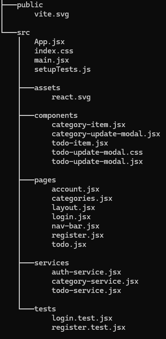
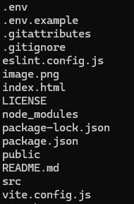

# Link del repositorio

https://github.com/DanyElAlgo/my-app

# Tecnologías usadas:

- React
- Supabase
- Vite
- Vitest

# Cómo ejecutar el proyecto y pruebas

Al descargar el proyecto, ejecutar los siguientes comandos:
```
npm install
npm install --save-dev vitest @testing-library/react @testing-library/jest-dom @testing-library/user-event
npm install -D vitest
npm install tailwindcss @tailwindcss/cli
```

Posteriormente, el proyecto puede ejecutarse mediante ``npm run dev``

# Patrón de diseño utilizado

Singleton

# Estructura del proyecto

<br>


# Problema que resuelve la aplicación

Un problema que existe en la comunidad es la falta de organización, esto causa que a las personas siempre se les olviden tareas por terminar.

# Solución planteada

Mi programa es una lista de tareas (o to-dos) para ayudar de alguna manera a que una persona recuerde todas sus actividades pendientes, así mejorar la habilidad de organización de tiempo.

# Historias de usuario

### HU: CRUD de categorías

Como usuario de la aplicación<br>
Quiero manejar categorías para mis tareas<br>
Para una mayor organización de estas.

Criterios de aceptación:
- Crear categoría:<br>
Dado el usuario<br>
Cuando quiera crear una nueva categoría<br>
Entonces podrá realizarlo desde la página de categorías, el único campo necesario es el nombre.

- Borrar categoría:<br>
Dado el usuario<br>
Cuando quiera deshacerse de una categoría<br>
Entonces podrá hacerlo seleccionando la categoría y dándole al botón de borrar. Las tareas se mantendrán, solo que perderán la categoría asignada cuando esta sea borrada.

- Actualizar nombre de categoría:<br>
Dado el usuario<br>
Cuando quiera cambiar el nombre de una categoría sin importar el motivo<br>
Entonces podrá actualizar la categoría dándole al botón de actualizar para cambiar el nombre, luego, se guardará al darle en Guardar.

- Listar categorías:<br>
Dado el usuario<br>
Cuando quiera ver las categorías que ha creado hasta el momento<br>
Entonces podrá dirigirse a la página de categorías para ver todas las que haya creado él mismo.

### HU: CRUD de tareas

Como usuario de la aplicación<br>
Quiero la habilidad de crear, actualizar, borrar y listar tareas<br>
Para llevar un control total de mis datos.

Criterios de aceptación:
- Crear tareas:<br>
Dado el usuario<br>
Cuando quiera crear una nueva tarea<br>
Entonces podrá hacerlo desde la pestaña de tareas, donde puede abrir un formulario para crear una nueva tarea, este formulario lleva los siguientes campos: Nombre, descripción y categoría al que pertenece (opcional).

- Remover tareas:<br>
Dado el cliente<br>
Cuando quiera eliminar una tarea
Entonces podrá hacerlo con el botón de eliminar tarea, esta le pedirá una confirmación antes de borrar dicha tarea, pues esta acción no se puede deshacer.

- Actualizar tareas:<br>
Dado el usuario<br>
Cuando quiera cambiar los datos de una tarea<br>
Entonces podrá actualizar los datos con el botón de actualizar, el cuál abrirá un modal para cambiar los datos de dicha tarea, también puede cambiarse el estado de completado de dicha tarea desde el modal de actualización.

- Listar tareas:
Dado el usuario<br>
Cuando quiera ver todas las tareas que ha creado<br>
Entonces podrá acceder a la pestaña de tareas para ver una lista con todas las tareas, sin importar si está o no completadas.

### HU: Separación de tareas y categorías por usuario

Como usuario de la aplicación<br>
Quiero que los elementos que haya creado yo sean exclusivamente míos<br>
Para una mayor privacidad de mis datos.

Criterios de aceptación:

- Separación por id de usuario<br>
Dado el usuario<br>
Cuando haya iniciado sesión<br>
Entonces la página guardará su id de usuario, con el cuál podrá acceder a todos los datos exclusivamente de dicho usuario, cualquier otra tarea o categoría será imposible de acceder para el usuario.

### HU: Manejo de compleción de una tarea

Como usuario<br>
Quiero una forma rápida de marcar una tarea como completada y deshacer el marcado en caso de error
Para llevar un mejor control de las tareas que tengo terminadas o tengo pendiente por completar

Criterios de aceptación:
- Botón de estado<br>
Dado el usuario<br>
Cuando acceda a su lista de tareas<br>
Entonces cada tarea tendrá un pequeño botón indicando el estado de dicha tarea (Completado o No completado).

- Cambio rápido de estado<br>
Dado el usuario<br>
Cuando quiera cambiar el estado de su tarea (Completado -> No completado y viceversa)<br>
Entonces podrá hacer el cambio rápido con el mismo botón que muestra el estado actual de la tarea.

- Cambio manual de estado en el formulario de actualización:<br>
Dado el usuario<br>
Cuando haya abierto el modal de actualizar tarea<br>
Entonces también podrá cambiar allí el estado de su tarea.

- Estado por defecto de la tarea:<br>
Dado el usuario<br>
Cuando haya creado una nueva tarea<br>
Entonces esta vendrá con el estado de No completada.

# Lecciones aprendidas

- Los archivos svg son más versátiles de lo que parece.
- Concentrarse demasiado en una sola funcionalidad es una pérdida de tiempo.
- Necesito usar mi propia aplicación, pues también tengo problemas de organización.